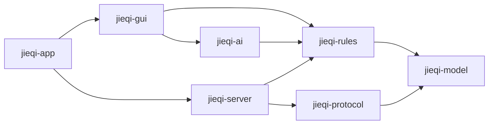

# Architecture

## Modules

`jieqi-model` and `jieqi-rules` contain no JavaFX or networking code. The server
owns authoritative network game state. Clients exchange DTOs and never share a
mutable `Board` object with the server.

## Core boundaries

- `GameState`: authoritative state, including hidden identities.
- `PlayerView`: information visible to one player; this is the only AI input.
- `GameEngine.apply`: the only state transition entry point.
- `Agent.chooseMove`: common interface for all AI levels.
- `ProtocolCodec`: JSON parsing, serialization and the 1 KiB frame gate.

## Initial implementation boundary

The framework implements initial board construction, coordinate validation,
remaining reveal pools, basic move rejection and application plumbing. Complete
piece movement, check detection, endgame rules and search algorithms are assigned
in `team-tasks.md`.

