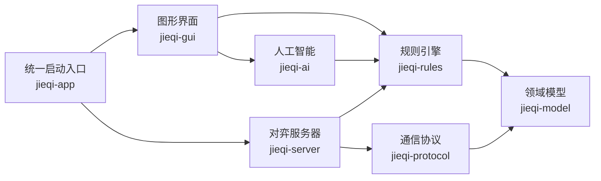

# 项目架构说明

## 模块关系

`jieqi-model` 和 `jieqi-rules` 不依赖 JavaFX 或网络代码。联网对局的完整状态由
服务器掌握，客户端只通过数据传输对象交换消息，不与服务器共享可变的 `Board`
对象。

## 各模块职责

- `jieqi-model`：棋盘、坐标、棋子、走法、玩家视图和对局状态。
- `jieqi-rules`：走法校验、状态推进、翻子、胜负及和棋规则。
- `jieqi-ai`：统一 AI 接口、随机策略、贪心策略和概率搜索。
- `jieqi-protocol`：公共消息结构、JSON 编解码和帧大小限制。
- `jieqi-server`：WebSocket 服务、匹配、房间、计时、裁决和棋谱。
- `jieqi-gui`：JavaFX 主界面、棋盘以及本地和联网模式。
- `jieqi-app`：图形界面和服务器的统一启动入口。

## 核心边界

- `GameState`：保存裁判掌握的完整状态，包括暗子真实身份。
- `PlayerView`：只保存指定玩家有权看到的信息，是 AI 的唯一对局输入。
- `GameEngine.apply`：推进棋局状态的唯一入口。
- `Agent.chooseMove`：所有 AI 策略使用的统一决策接口。
- `ProtocolCodec`：负责 JSON 解析、序列化和 1 KiB 文本帧限制。

## 数据流

本地对局由 JavaFX 客户端调用规则引擎推进棋局。联网对局中，客户端只提交走法，
服务器调用同一套规则引擎完成校验、翻子和终局判断，再将公开结果发送给双方。
随机翻子结果必须由裁判端生成，客户端不能指定暗子的真实类型。

## 当前实现边界

现有框架已经实现初始棋盘、坐标检查、暗子类型池、基础走法拒绝与状态推进管线。
完整棋子移动规则、将军检测、终局规则、搜索算法、房间对局和界面交互仍需按照
`开发任务.md` 继续完善。
